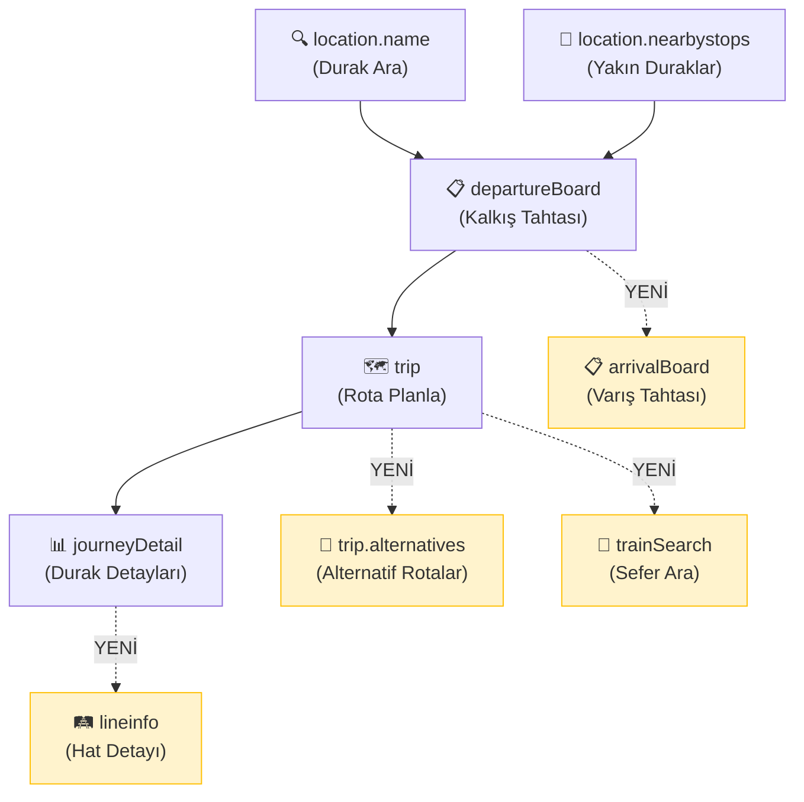

# HAFAS 2.52.0 → TopluTasima: Eklenebilecek Özellikler

Mevcut kodun derinlemesine incelenmesi sonucu, HAFAS API 2.52.0 yetenekleri ile uygulamanın mevcut mimarisi karşılaştırılmıştır. Aşağıda **öncelik sırasına göre** eklenebilecek özellikler detaylandırılmıştır.

> [!NOTE]
> Bu dokümanda hiçbir kod değişikliği önerilmemekte, yalnızca **ne eklenebilir** ve **neden değerli** olduğu anlatılmaktadır.

---

## 🔴 Yüksek Öncelik — Mevcut Akışı Doğrudan İyileştirecek

### 1. `Authorization: Bearer` Header Desteği

| Şu an | Olması gereken |
|--------|---------------|
| `accessId` query parametresi ile gönderiliyor | `Authorization: Bearer <key>` header ile gönderilmeli |

**Neden önemli:**
- API key URL'de açıkça görünüyor (`RmvRetrofitClient.kt` satır 24-69 ve `RmvApiService.kt` satır 314, 514)
- Logcat, proxy tool veya network inspector kullanan biri anahtarı kolayca görebilir
- Header-based auth daha güvenli ve modern
- RMV tarafında query string'deki key'ler loglanıyor olabilir

**Etkilenen dosyalar:**
- [RmvRetrofitClient.kt](file:///c:/Users/mehme/AndroidStudioProjects/TopluTasima/app/src/main/java/com/example/toplutasima/network/rmv/RmvRetrofitClient.kt) — OkHttp Interceptor eklenip tüm isteklere header eklenebilir
- [RmvApiService.kt](file:///c:/Users/mehme/AndroidStudioProjects/TopluTasima/app/src/main/java/com/example/toplutasima/network/RmvApiService.kt) — OkHttp ile yapılan çağrılardaki URL'lerden `accessId` kaldırılır

---

### 2. `requestId` Tracking Desteği

**Şu an:** Hata durumunda sadece HTTP code ve kısa mesaj loglanıyor (örn. satır 318, 517).

**Eklenirse:**
- Her API isteğine `requestId=<UUID>` eklenir
- Hata loglarına bu ID yazılır
- Support'a birebir örnek gönderilebilir
- "Bu request neden hatalı döndü?" sorusuna cevap bulunabilir

**Pratik değer:** Daha önce yaşanan "18:17 yerine 18:23 dönüyor" tarzı sorunlarda, RMV support'a gönderilecek `requestId` ile kesin tespit yapılabilir.

---

### 3. HTTP 429 (API_QUOTA) Yönetimi

**Şu an:** `RmvApiService.kt`'de hata yönetimi genel `Exception` catch'leriyle yapılıyor. Rate limit durumunda kullanıcıya anlamlı bir mesaj gösterilemiyor.

**Eklenirse:**
- HTTP 429 kodu yakalanır
- Kullanıcıya "Kota aşıldı, lütfen biraz bekleyin" mesajı gösterilir
- Opsiyonel: exponential backoff ile otomatik retry
- Opsiyonel: `Retry-After` header'ı okunur

**Etkilenen yerler:** Tüm API çağrılarının `catch` blokları.

---

### 4. `trip.alternatives` Servisi

**Şu an:** `fetchTripBasic()` (satır 510-539) tek bir trip araması yapıp ilk uygun sonucu döndürüyor. `numF=6` ile birkaç sonuç alıyor ama hepsi aynı `trip` endpoint'inden.

**`trip.alternatives` eklenirse:**
- Kullanıcı bir rota seçtikten sonra "Alternatif Rotalar" butonu gösterilebilir
- Aynı bağlamda daha erken/geç/farklı hat kombinasyonları sunulur
- Özellikle aktarmalı yolculuklarda kullanıcıya seçenek sunar

**UI etkisi:** Departure listesi altına veya plan kartına "🔄 Alternatifler" butonu + bottom sheet.

---

### 5. `journeyDetail` Çağrısının Retrofit'e Taşınması

**Şu an:** `fetchJourneyStops()` (satır 306-434) `OkHttp` + `org.json.JSONObject` ile çalışıyor. Ancak `RmvApi` interface'inde zaten bir `getJourneyDetail` tanımı var (satır 53-58).

**Yapılırsa:**
- `journeyDetail` çağrısı Retrofit üzerinden yapılır (zaten tanımlı!)
- `org.json` bağımlılığı adım adım azaltılır
- Tutarlılık artar (diğer servislerin hepsi Retrofit)

> [!IMPORTANT]
> Bu, HAFAS 2.52.0'a özel bir yenilik değil ama API güncellemesiyle birlikte mimarisel tutarlılık için ideal zamanlama.

---

## 🟡 Orta Öncelik — Kullanıcı Deneyimini Zenginleştirecek

### 6. `lineinfo` / `linesearch` Servisleri

**Şu an:** Hat bilgisi sadece trip/departure response'larından parse ediliyor. Hat hakkında ek bilgi (tarife, güzergah haritası, sefer sıklığı) yok.

**Eklenirse:**
- "Hat Detayı" ekranı: Kullanıcı bir hattın üzerine tıklayınca o hattın tam güzergahı, çalışma saatleri ve durakları gösterilir
- SummaryScreen'deki "Top Hatlar" bölümüne tıklanabilirlik kazandırılır
- `linesearch` ile hat ismi araması yapılabilir

**Yeni servis endpoint'leri (RmvApi interface'e eklenecek):**
```
GET lineinfo?accessId=...&id=<lineId>&format=json
GET linesearch?accessId=...&input=<searchTerm>&format=json
```

**UI etkisi:** Yeni bir "Hat Detayları" bottom sheet veya ekran.

---

### 7. `trainSearch` Servisi

**Şu an:** Belirli bir trenin/seferin aranması direkt yapılamıyor. Kullanıcı A→B trip araması yapmak zorunda.

**Eklenirse:**
- "Sefer Ara" özelliği: Kullanıcı doğrudan "S5" veya "RE30" yazarak o seferin güncel durumunu, güzergahını görebilir
- `match` ve `date` parametreleriyle hızlı sonuç
- Sonuç `JourneyDetailList` döner → mevcut `fetchJourneyStops` altyapısı ile doğrudan uyumlu

**Kullanım senaryosu:** "Şu an S5 nerede?" veya "RE30'un bugünkü seferleri."

---

### 8. `arrivalBoard` Servisi

**Şu an:** Uygulama sadece `departureBoard` kullanıyor (satır 169-302).

**Eklenirse:**
- Varış durağı için "Geliş Tahtası" gösterilebilir
- Kullanıcı hem kalkış hem varış durağının canlı verilerini görebilir
- Özellikle "benim trenim ne zaman geliyor?" sorusuna cevap verir

**Retrofit tanımı:**
```
GET arrivalBoard?accessId=...&id=<stopId>&date=...&time=...&format=json
```

---

### 9. `datainfo` Servisi — Metadata Cache

**Şu an:** Product class bitmask'ları ve operator kodları hardcoded regex ile çözümleniyor (`mapTypeTr` fonksiyonları).

**Eklenirse:**
- VehicleType mapping'i API'den dinamik olarak çekilir
- Yeni araç tipleri (ferry, AST vb.) otomatik desteklenir
- Operator bilgisi Firestore kaydına eklenebilir

**Retrofit tanımı:**
```
GET datainfo?accessId=...&format=json
```

---

### 10. `location.name` — `operators` Filtresi (2.51.0)

**Şu an:** `searchStops()` (satır 55-99) tüm operatörlerin duraklarını döndürüyor.

**Eklenirse:**
- Sadece belirli operatörlerin (örn. sadece RMV) duraklarını göster
- Karma veri setlerinde gereksiz sonuçları filtrele
- Parametre: `operators=<operatorCode>`

**Tek satır değişiklik:** `RmvApi.searchStops()` fonksiyonuna `@Query("operators") operators: String? = null` eklenmesi.

---

## 🟢 Düşük Öncelik — Gelecek İçin Stratejik

### 11. `geofeature.nearby` / `geofeature.boundingbox`

**Şu an:** `searchNearbyStops()` sadece durak buluyor (satır 105-165).

**Eklenirse:**
- Harita üzerinde bisiklet istasyonları, park alanları, scooter noktaları gösterilebilir
- `BICYCLE_PATH`, `STATION_AREA`, `PARKING_ZONE`, `GEO_REGION` sorgulanabilir
- Multimodal ulaşım deneyimi (Park & Ride senaryosu)

**Gereksinim:** Harita entegrasyonu (Google Maps / OSM) — mevcut kodda yok.

---

### 12. `reachability` Servisi

**Şu an:** Böyle bir özellik yok.

**Eklenirse:**
- "30 dakikada neresi ulaşılabilir?" analizi
- Isochrone haritası (erişilebilirlik çemberi)
- SummaryScreen'e "Ne kadar alan kapsıyorsun?" istatistiği

**Gereksinim:** Harita entegrasyonu + Canvas/Polygon çizimi.

---

### 13. `rtarchive-v2` — Gecikme Geçmişi

**Şu an:** Gecikme bilgisi sadece kullanıcının manuel girdiği `gercekBinis/gercekInis` üzerinden hesaplanıyor.

**Eklenirse:**
- Geçmiş canlı veri arşivinden hat bazlı gecikme trendi çekilebilir
- SummaryScreen'deki gecikme istatistikleri API verileriyle zenginleştirilebilir
- "Bu hat genelde ne kadar gecikiyor?" sorusuna otomatik cevap

---

### 14. `trafficmessages/datex2` — Trafik Uyarıları

**Şu an:** Disruption/uyarı bilgisi gösterilmiyor.

**Eklenirse:**
- Kalkış tahtasında "⚠️ Bu hatta arıza var" uyarısı
- Plan kartında gecikme/iptal bildirimi
- Push notification potansiyeli

---

### 15. `qrcode.match` — Bilet/QR Eşleme

**Şu an:** Manuel giriş modu var ama QR tarama yok.

**Eklenirse:**
- Kamera ile bilet QR kodu okutulur
- Otomatik olarak ilgili yolculuk eşleşir
- Manuel giriş yerine tek tarama ile kayıt başlatılabilir

**Gereksinim:** CameraX entegrasyonu + ML Kit Barcode Scanner.

---

## 🔵 PDF'den Çıkan Ek Özellik Fırsatları

HAFAS 2.52.0 PDF dokümanında, mevcut listede olmayan ama TopluTasima'nın akışlarına eklenebilecek başka servisler de var. Aşağıdaki fikirler, mevcut uygulamadaki **favori duraklar**, **yakındaki duraklar**, **rota planlama**, **özet/analiz**, **bildirim** ve gelecekteki **harita** kullanımına göre seçilmiştir.

> [!IMPORTANT]
> PDF genel HAFAS ReST arayüzünü anlatır; RMV HAPI kurulumunda her endpoint açık olmayabilir. Bu yüzden her özellikten önce küçük bir "endpoint availability probe" yapılmalı: örnek istek at, HTTP durumunu ve dönen hata kodunu logla, servis kapalıysa uygulamada özelliği gizle.

---

### 16. `multiDepartureBoard` / `multiArrivalBoard` — Favori Duraklar İçin Toplu Canlı Pano

**Şu an:** Uygulama tek bir durak için `departureBoard` çağırıyor. Favori duraklar varsa her biri için ayrı istek atmak gerekir; bu da hem yavaşlar hem quota tüketimini artırır.

**Eklenirse:**
- Ayarlardaki favori durakların tamamı için tek çağrıda canlı kalkış/varış listesi alınabilir
- "Favorilerimden yakında kalkacak seferler" gibi kompakt bir ana ekran modülü yapılabilir
- Ev/iş/okul gibi sık kullanılan duraklar birlikte izlenebilir
- Birden fazla durak içeren aktarma noktalarında kullanıcı tek listede karşılaştırma yapabilir

**Kullanım senaryosu:**
- Kullanıcı uygulamayı açar ve favori duraklarından önümüzdeki 30-60 dakikadaki seferleri tek listede görür
- Varış modu eklenirse "bu duraklara hangi araçlar geliyor?" sorusu da cevaplanır

**Teknik notlar:**
- `idList` parametresi `|` ile ayrılmış durak ID listesi bekler
- Sonuçlar tek karışık liste olarak dönebilir; UI tarafında durak adına, hatta ve saate göre gruplanmalı
- Mevcut `Departure` modeline kaynak durak adı/ID alanı eklemek gerekebilir

**Etkilenen yerler:**
- `RmvApi` interface'e yeni endpoint tanımları
- Favori durakları okuyan `SettingsViewModel` / ilgili repository akışı
- Yeni bir "Favori Canlı Pano" kartı veya mevcut RMV ekranında hızlı panel

**Öncelik:** Yüksek. Mevcut favori durak konseptiyle doğrudan uyumlu ve API çağrı sayısını azaltabilir.

---

### 17. `nearbyDepartureBoard` / `nearbyArrivalBoard` — Yakınımdaki Seferler

**Şu an:** Yakın durak akışı önce `location.nearbystops` ile durak buluyor, sonra seçilen durak için `departureBoard` çağırıyor.

**Eklenirse:**
- Kullanıcının koordinatına göre çevredeki durakların kalkışları tek çağrıda alınabilir
- "Şu an yakınımdan ne kalkıyor?" ekranı yapılabilir
- Yakındaki durakları tek tek seçmeden, yürünebilir çevredeki tüm seçenekler gösterilebilir
- Konum tabanlı hızlı rota kaydı daha pratik hale gelir

**Kullanım senaryosu:**
- Kullanıcı dışarıdayken konum izni verir
- Uygulama 500-1000 m yarıçaptaki duraklardan yaklaşan kalkışları listeler
- Kullanıcı doğrudan bir sefer seçip kayıt/rota planlama akışına geçer

**Teknik notlar:**
- Temel parametreler koordinat (`originCoordLat`, `originCoordLong`), yarıçap (`r`), tarih/saat, süre ve maksimum sonuç sayısıdır
- Liste farklı durakların kalkışlarını karışık döndürebilir; UI'da "durak grubu" veya "zamana göre sıralı" görünüm seçilmeli
- Konum izni ve hata durumları mevcut `NearbyStopsManager` ile aynı UX modelini kullanabilir

**Etkilenen yerler:**
- `NearbyStopsManager`
- `RmvLogViewModel` içinde yakındaki durak seçme akışı
- Yakın durak UI bileşenleri

**Öncelik:** Yüksek. Mevcut konum tabanlı durak bulma akışını daha hızlı ve kullanışlı yapar.

---

### 18. `location.details` — Durak Detay Sayfası

**Şu an:** Durak arama sonuçlarında genellikle sadece ID ve ad kullanılıyor. Durağın koordinatı, ürün sınıfları, attribute/infotext bilgileri ve ek metadata uygulama içinde ayrı bir detay olarak gösterilmiyor.

**Eklenirse:**
- Durak adına tıklanınca detay bottom sheet açılabilir
- Koordinat, çalışan ürün tipleri, açıklama/infotext ve erişilebilirlik notları gösterilebilir
- Favoriye ekleme ekranında kullanıcı doğru durağı seçtiğinden emin olabilir
- Aynı isimli duraklarda ayrım yapmak kolaylaşır

**Kullanım senaryosu:**
- Kullanıcı "Hauptbahnhof" arar
- Sonuçlardan birine uzun basar veya bilgi ikonuna dokunur
- Durak detayında konum, hat/product bilgisi ve varsa uyarılar gösterilir

**Teknik notlar:**
- `id` parametresi birden çok durak için `|` ile ayrılmış liste kabul edebilir
- `attributes`, `infotexts`, `products` parametreleriyle yanıt zenginleştirilebilir
- Dönen not/attribute kodları için `l10n.notes` ile lokalizasyon desteği eklenebilir

**Etkilenen yerler:**
- `StopOption` modeline opsiyonel koordinat ve açıklama alanları
- Durak arama dropdown / favori düzenleme ekranı
- İleride harita entegrasyonu

**Öncelik:** Orta-Yüksek. Küçük UI eklemesiyle seçim doğruluğunu artırır.

---

### 19. `location.boundingbox` — Harita Alanındaki Durakları Getirme

**Şu an:** Uygulamada harita yok; yakın durak araması sadece merkez koordinat + yarıçap ile çalışıyor.

**Eklenirse:**
- Harita eklendiğinde görünen alan içindeki tüm duraklar çekilebilir
- Kullanıcı haritayı kaydırdıkça yeni duraklar yüklenebilir
- Durak yoğunluğu, aktarma noktaları ve yakın çevre görsel olarak sunulabilir

**Kullanım senaryosu:**
- Kullanıcı "Haritada Duraklar" sekmesini açar
- Uygulama görünür harita sınırlarını `llLat`, `llLon`, `urLat`, `urLon` olarak gönderir
- Dönen duraklar marker olarak çizilir

**Teknik notlar:**
- `type` filtresiyle sadece duraklar, POI'ler veya entry point'ler seçilebilir
- Harita hareketlerinde debounce gerekir; aksi halde çok sık istek atılabilir
- Sonuçlar viewport bazlı cache'lenebilir

**Gereksinim:** Google Maps veya OSM/MapLibre gibi bir harita katmanı.

**Öncelik:** Düşük-Orta. Harita entegrasyonu gelirse çok değerli, mevcut UI için ön koşullu.

---

### 20. `location.search` / `location.addresslookup` — Gelişmiş Lokasyon ve Adres Arama

**Şu an:** Durak arama `location.name` odaklı. Kullanıcı adres, POI veya ürün tipi filtreli geniş arama yapamıyor.

**Eklenirse:**
- Sadece tren, sadece otobüs, sadece belirli product sınıfları gibi filtreli arama yapılabilir
- Sayfalı sonuç (`scrollCtx`, `scrollSize`) ile büyük listeler yönetilebilir
- Koordinat çevresindeki adres/POI önerileri alınabilir
- Rota başlangıcı/hedefi sadece durak değil, adres veya POI olabilir

**Kullanım senaryosu:**
- Kullanıcı bir adres girer veya haritada nokta seçer
- `location.addresslookup` ile en yakın adres/POI bulunur
- Rota planlama bu koordinat veya yakın durak üzerinden başlatılır

**Teknik notlar:**
- `location.search` product bitmask değerleri için `datainfo` ile beraber düşünülmeli
- Adres/POI sonuçları `StopOption` modelinden ayrı bir `LocationOption` modeli gerektirebilir
- Mevcut UI'da "Durak" ve "Adres/POI" sekmeleri yapılabilir

**Öncelik:** Orta. Rota planlamayı daha doğal yapar ama model katmanında ayrım gerektirir.

---

### 21. `location.walkinglinks` / `walkinglinks` — İstasyon İçi Yürüyüş ve Erişilebilirlik Bağlantıları

**Şu an:** Aktarma veya durak içi yürüyüş bağlantıları özel olarak gösterilmiyor. Uygulama yolculuk süresi ve durak listesine odaklanıyor.

**Eklenirse:**
- İstasyon içindeki yürüyüş bağlantıları, asansörler, geçişler ve erişilebilirlik notları gösterilebilir
- Aktarmalı rotalarda "hangi çıkış/geçiş daha uygun?" bilgisi zenginleşir
- Engelli erişimi, bebek arabası veya bisikletle yolculuk yapan kullanıcılar için değer artar

**Kullanım senaryosu:**
- Kullanıcı aktarmalı bir rota planlar
- Aktarma durağında yürüyüş bağlantısı varsa plan kartında "Yürüyüş/erişilebilirlik detayı" açılır
- Asansör veya özel geçiş notları gösterilir

**Teknik notlar:**
- `location.walkinglinks` belirli bir duraktan başlayan bağlantıları getirir
- Global `walkinglinks` servisi tüm yürüyüş bağlantılarını filtreli almak için kullanılabilir
- `fattributes` ile asansör gibi attribute kodlarına göre filtreleme yapılabilir

**Öncelik:** Orta. Özellikle büyük istasyonlar ve erişilebilirlik için değerli.

---

### 22. `gisroute` — Yürüyüş/GIS Bacağı Detayı

**Şu an:** Uygulamada mesafe için ORS kullanımı var; trip içindeki yürüyüş bacakları HAFAS tarafındaki GIS bağlamıyla ayrıca detaylandırılmıyor.

**Eklenirse:**
- Trip response içindeki GIS route context üzerinden yürüyüş rotası, polyline, talimat ve mesafe alınabilir
- Kısa yürüyüş/aktarma bacakları için ORS yerine HAFAS'ın kendi bağlamı kullanılabilir
- Plan kartında "3 dk yürü, şu çıkıştan devam et" gibi daha anlaşılır yönlendirme yapılabilir

**Kullanım senaryosu:**
- Trip sonucunda yürüyüş bacağı varsa GIS context saklanır
- Kullanıcı yürüyüş bacağına dokununca detay açılır
- Polyline ileride haritada çizilir

**Teknik notlar:**
- `ctx` parametresi trip sonucundan gelir
- `poly=1` ve `polyEnc=GPA/DLT` ile haritada çizilebilir rota alınabilir
- HAFAS GIS context yoksa mevcut ORS fallback'i korunmalı

**Öncelik:** Orta. Mevcut ORS/mesafe hesaplama mantığını tamamlayabilir.

---

### 23. `interval` — Saat Aralığında Rota Arama

**Şu an:** Rota planlama tek tarih/saat çevresinde `trip` çağrısı yapıyor ve birkaç sonuç arasından seçim yapıyor.

**Eklenirse:**
- "Önümüzdeki 2 saat içinde en iyi seçenekler" gibi aralık bazlı rota araması yapılabilir
- Sık kullanılan iki durak arasında gün içi sefer yoğunluğu analiz edilebilir
- Kullanıcı belirli bir zaman aralığında en erken varış, en az aktarma veya en kısa süreyi karşılaştırabilir

**Kullanım senaryosu:**
- Kullanıcı başlangıç/hedef ve saat aralığı seçer
- Uygulama `duration` ile aralık içindeki rotaları alır
- Sonuçlar süre, aktarma sayısı ve bekleme süresine göre gruplanır

**Teknik notlar:**
- `duration` dakika cinsinden arama aralığını belirler
- `max` minimum dönecek bağlantı sayısını belirlemek için kullanılabilir
- `numF`/`numB` bu serviste etkili olmayabilir; ayrı parametre modeli gerekir

**Öncelik:** Orta. Rota planlama UX'ini güçlendirir.

---

### 24. `recon` / `reconConvert` — Kayıtlı Rotayı Yeniden Kurma

**Şu an:** Firestore kayıtlarında rota segmentleri ve planlanan/gerçek zamanlar tutuluyor; ancak HAFAS `ctxRecon` bağlamı saklanmıyorsa aynı yolculuğu daha sonra birebir yeniden oluşturmak zor.

**Eklenirse:**
- Trip sonucundan gelen reconstruction context Firestore kaydına eklenebilir
- Eski bir kayıt daha sonra HAFAS üzerinde tekrar kurulup güncel timetable/RT durumuyla karşılaştırılabilir
- Kullanıcı "bu kayıt hangi HAFAS planına dayanıyordu?" sorusuna daha kesin cevap alır
- `reconConvert` ile karmaşık context daha basit/uyumlu bir forma dönüştürülebilir

**Kullanım senaryosu:**
- Rota kaydedilirken `ctxRecon` de saklanır
- Kullanıcı kayıt detayında "Planı tekrar kontrol et" der
- Uygulama `recon` ile aynı yolculuğu yeniden kurar ve değişen saat/hat bilgilerini gösterir

**Teknik notlar:**
- Firestore şemasına opsiyonel `ctxRecon` alanı eklenmeli
- Eski kayıtlarda bu alan olmayacağı için null-safe migration gerekir
- Context zamanla geçersizleşebilir; hata durumunda normal trip aramasına fallback yapılmalı

**Öncelik:** Orta-Yüksek. Kayıt geçmişi ve doğrulama için çok güçlü bir temel sağlar.

---

### 25. `journeyTrackMatch` / `reconMatch` — GPS İzinden Yolculuk Eşleştirme

**Şu an:** Toplu taşıma kaydı büyük ölçüde kullanıcının seçtiği plan/sefer ve manuel girişleriyle ilerliyor. Kişisel yolculuk tarafında GPS waypoint mantığı var, fakat toplu taşıma sefer eşleştirme için kullanılmıyor.

**Eklenirse:**
- Kullanıcının konum izinden hangi hatta/sefere bindiği otomatik tahmin edilebilir
- "Bindim" sonrası arka planda kısa süreli track toplanıp doğru sefer doğrulanabilir
- Manuel hat/durak seçimi azaltılabilir
- Yanlış sefer seçimi veya geç kalmış kalkışlarda kayıt kalitesi artar

**Kullanım senaryosu:**
- Kullanıcı toplu taşıma takibini başlatır
- Uygulama izin dahilinde birkaç GPS noktası toplar
- `journeyTrackMatch` ile en olası sefer bulunur ve kullanıcıya doğrulatılır

**Teknik notlar:**
- Bu servis POST body gerektirir; Retrofit modellemesi GET endpoint'lerinden farklı olacak
- Konum izni, pil tüketimi ve gizlilik için açık kullanıcı kontrolü gerekir
- Sonuç güven skoruyla gelirse UI'da "yüksek/düşük eşleşme" ayrımı yapılmalı

**Gereksinim:** Arka plan konum stratejisinin toplu taşıma modu için ayrı tasarlanması.

**Öncelik:** Orta. Büyük değer sunar ama gizlilik ve pil maliyeti nedeniyle dikkatli tasarlanmalı.

---

### 26. `journeyPos` — Canlı Araç Konumu

**Şu an:** Uygulama kalkış/varış saatleri ve durak listesine odaklanıyor; araçların harita üzerindeki canlı konumu gösterilmiyor.

**Eklenirse:**
- Belirli bir harita alanındaki araçların gerçek zamanlı pozisyonları çekilebilir
- Seçili hat veya ürün tipi filtrelenerek "S5 araçları nerede?" gibi görünüm yapılabilir
- Aktif takip sırasında kullanıcının beklediği aracın yaklaşımı görselleştirilebilir

**Kullanım senaryosu:**
- Kullanıcı bir kalkışı seçer
- Hat/ürün filtresiyle ilgili araç pozisyonları alınır
- Haritada veya kompakt bir "yaklaşıyor" göstergesinde sunulur

**Teknik notlar:**
- Servis bounding box ister; harita veya konuma dayalı alan hesabı gerekir
- `operators`, `products`, `lines` gibi filtreler quota ve performans için önemli
- Araç konumu her bölgede/hatta mevcut olmayabilir; graceful fallback şart

**Öncelik:** Orta-Düşük. Harita entegrasyonu ve servis erişimi varsa kullanıcı deneyimini ciddi zenginleştirir.

---

### 27. `journeyMatch` — Metinden Sefer Detayı Bulma

**Şu an:** `.md` içinde `trainSearch` öneriliyor; o servis birden fazla eşleşme için uygun. `journeyMatch` ise ilk eşleşen seferin daha detaylı rotasını döndürür.

**Eklenirse:**
- Kullanıcı "RE 30", "S1", "ICE 827" gibi metin girerek doğrudan sefer detayına ulaşabilir
- `journeyDetail` yapısıyla benzer cevap döndüğü için mevcut durak listesi parser'ına yakın entegre edilebilir
- Belirli bir seferi hızlı doğrulama/debug aracı olarak kullanılabilir

**Kullanım senaryosu:**
- Kullanıcı "Sefer Ara" alanına hat/tren numarası yazar
- Uygulama `journeyMatch` ile ilk güçlü eşleşmeyi getirir
- Tam durak listesi ve gerçek zaman bilgisi gösterilir

**Teknik notlar:**
- Çoklu sonuç gerektiğinde `trainSearch`, tek detay gerektiğinde `journeyMatch` kullanılmalı
- Yanlış ilk eşleşme riskine karşı tarih, istasyon veya direction filtresi eklenmeli

**Öncelik:** Orta. `trainSearch` ile birlikte düşünülmeli.

---

### 28. `linematch` / `linesched` — Hat Eşleştirme ve Günlük Hat Tarifesi

**Şu an:** `.md` içinde `lineinfo` ve `linesearch` öneriliyor. Bunlar hat detayının temelini kurar; `linematch` ve `linesched` bu ekranı daha kullanışlı hale getirir.

**Eklenirse:**
- `linematch`: Kullanıcının "S9", "RE30" gibi girişlerinden olası hatlar bulunur
- `linesched`: Seçili hattın belirli bir tarihteki tüm seferleri ve yönleri gösterilir
- Hat detay ekranında sadece güzergah değil, gün içi çalışma düzeni de görülebilir
- SummaryScreen'deki "Top Hatlar" listesinden hat detayına geçiş anlamlı hale gelir

**Kullanım senaryosu:**
- Kullanıcı özet ekranında en çok kullandığı hatta dokunur
- Uygulama hattı `linematch` ile doğrular
- `linesched` ile bugünkü/yarınki sefer akışı gösterilir

**Teknik notlar:**
- `linesched` için `lineId` gerekir; bu ID `linesearch`, `linematch` veya trip response ürün bilgisinden alınmalı
- Sefer listesi büyük olabilir; yön, saat aralığı ve favori durak filtresi gerekebilir
- Hat rengi/icon bilgisi product içinden UI'a taşınabilir

**Öncelik:** Orta. Hat detay ekranı yapılacaksa bu ikili çok tamamlayıcı.

---

### 29. `himsearch` / `feed` — Toplu Taşıma Uyarıları ve Duyuru Akışı

**Şu an:** `.md` içinde `trafficmessages/datex2` trafik uyarıları olarak öneriliyor. Toplu taşıma disruption/duyuru tarafı için HAFAS'ın HIM arama ve RSS feed servisleri de kullanılabilir.

**Eklenirse:**
- Belirli tarih aralığı, hat, kategori veya bölgeye göre disruption mesajları çekilebilir
- Kalkış kartında "bu hatta duyuru var" uyarısı gösterilebilir
- Aktif takipte ilgili hatta yeni uyarı varsa bildirim üretilebilir
- RSS formatlı `feed` ile daha basit bir duyuru akışı da sunulabilir

**Kullanım senaryosu:**
- Kullanıcı bir hattı veya rotayı seçer
- Uygulama ilgili hat/operator için HIM mesajlarını sorgular
- Plan kartı ve bildirimlerde iptal, gecikme, çalışma, yön değişikliği gibi bilgiler gösterilir

**Teknik notlar:**
- HIM filtreleri kurulumdan kuruluma farklı olabilir; önce RMV'nin desteklediği filtreler test edilmeli
- Mesajlar çok dilli ve kategorili gelebilir; UI'da kısa/uzun metin ayrımı yapılmalı
- `trafficmessages/datex2` daha trafik/road odaklı kalırsa, toplu taşıma uyarıları için `himsearch` önceliklendirilmeli

**Öncelik:** Yüksek. Gecikme/iptal bilgisini görünür kılmak kullanıcı değerini doğrudan artırır.

---

### 30. `l10n.notes` — HAFAS Not Kodlarını Yerelleştirme

**Şu an:** Uygulamada TR/DE/EN metinler `Strings.kt` içinde yönetiliyor; HAFAS'tan gelen attribute/note kodları için merkezi bir çeviri cache'i yok.

**Eklenirse:**
- Bisiklet taşıma, erişilebilirlik, rezervasyon, uyarı gibi HAFAS note kodları kullanıcının dilinde gösterilebilir
- `location.details`, `walkinglinks`, `journeyDetail`, `himsearch` gibi zengin cevaplar daha anlaşılır olur
- Kod bazlı ham metin göstermek yerine okunabilir açıklamalar sunulur

**Kullanım senaryosu:**
- Journey detail içinde `FB`, `FR`, `FT` gibi not kodları gelir
- Uygulama ilk açılışta veya ihtiyaç anında `l10n.notes` ile TR/DE/EN karşılıklarını cache'ler
- UI'da seçili dile göre not açıklaması gösterilir

**Teknik notlar:**
- `attributes` ve `languages` parametreleri virgülle ayrılmış liste alır
- Prefs veya küçük bir local cache ile tekrar tekrar istek atılması engellenmeli
- Çeviri yoksa HAFAS'ın döndürdüğü metne veya koda fallback yapılmalı

**Öncelik:** Orta. Diğer metadata özellikleri eklenirse kaliteyi belirgin artırır.

---

### 31. `tti` / `timetableinfo` — HAFAS Veri Seti Durumu

**Şu an:** Uygulama HAFAS tarafındaki timetable veri setinin geçerlilik aralığını veya son yükleme bilgisini göstermiyor.

**Eklenirse:**
- Bakım ekranında HAFAS veri havuzlarının başlangıç/bitiş tarihleri gösterilebilir
- "Veri eski mi, timetable değişmiş mi?" gibi debug sorularına hızlı cevap alınır
- API güncellemesi veya beklenmeyen rota farklarında teknik teşhis kolaylaşır

**Kullanım senaryosu:**
- Kullanıcı/geliştirici Bakım ekranını açar
- Uygulama `tti` çağrısı yapar
- Veri seti tipi, geçerlilik aralığı ve oluşturulma zamanı listelenir

**Teknik notlar:**
- Kullanıcıya çok teknik görünmemesi için bu bilgi "Bakım/Debug" altında tutulmalı
- Hata raporlarına `serverVersion`, `dialectVersion`, `requestId` ve timetable bilgisi eklenebilir

**Öncelik:** Düşük-Orta. Kullanıcı özelliğinden çok bakım/debug değeri taşır.

---

### 32. `geofeature.details` — GeoFeature Detay Ekranı

**Şu an:** `.md` içinde `geofeature.nearby` ve `geofeature.boundingbox` öneriliyor; ancak listeden seçilen geo feature için detay ekranı ayrıca tanımlanmamış.

**Eklenirse:**
- Haritada seçilen bisiklet istasyonu, park alanı, scooter noktası veya trafik feature'ı için detay alınabilir
- GeoJSON/polygon bilgisi varsa haritada alan olarak çizilebilir
- Mobility provider bilgisi, availability ve webview URL gibi ek alanlar gösterilebilir

**Kullanım senaryosu:**
- Kullanıcı haritada bir bisiklet/park/traffic marker'ına dokunur
- Uygulama `geofeature.details` ile detay çeker
- Alt panelde sağlayıcı, durum ve alan/çizgi bilgisi gösterilir

**Teknik notlar:**
- `id` parametresi `geofeature.nearby` veya `geofeature.boundingbox` sonucundan alınır
- GeoJSON alanı base64/encoded gelebilir; güvenli parse ve fallback gerekir
- Bu özellik harita entegrasyonu olmadan düşük görünürlükte kalır

**Öncelik:** Düşük. GeoFeature harita özelliği yapılırsa tamamlayıcıdır.

---

### 33. `tariff.transportassociation` / `tariff.validation` — Tarife ve Bilet Doğrulama

**Şu an:** Uygulamada bilet kontrolü kullanıcı tarafından manuel checkbox olarak kaydediliyor; tarife veya ücret doğrulama yok.

**Eklenirse:**
- Reconstruction context üzerinden rota için tarife bilgisi alınabilir
- Desteklenen kurulumlarda bilet/tarife context doğrulaması yapılabilir
- QR eşleme özelliğiyle birlikte "bu bilet bu yolculuğa uygun mu?" akışı kurulabilir

**Kullanım senaryosu:**
- Kullanıcı QR ile bilet okutur
- Yolculuk context'i ve bilet/tarife bilgisi eşleştirilir
- Uygulama geçerlilik sonucunu kayıt detayına ekler

**Teknik notlar:**
- Bu servisler büyük ihtimalle kurulum/association bazlı özel konfigürasyon ister
- RMV tarafında erişim yoksa özellik tamamen gizlenmeli
- Hukuki/finansal yorum yapılmamalı; sadece API'nin döndürdüğü geçerlilik durumu gösterilmeli

**Öncelik:** Düşük. QR/bilet akışı yapılırsa değerlendirilmeli.

---

### 34. `downloads` / `xsd` — Geliştirici ve Şema Bakım Araçları

**Şu an:** API response modelleri elle yazılıyor; HAFAS XSD veya protected download listesi üzerinden otomatik model/şema takibi yok.

**Eklenirse:**
- `xsd` ile kullanılan HAFAS sürümünün şeması indirilebilir
- Response model değişiklikleri için geliştirici kontrolü yapılabilir
- `downloads` açıksa accessId korumalı ek dosyalar listelenebilir
- CI veya manuel bakım sürecinde "HAFAS şeması değişti mi?" kontrolü eklenebilir

**Kullanım senaryosu:**
- Geliştirici API güncellemesi öncesi XSD indirir
- DTO alanlarıyla şema karşılaştırılır
- Riskli değişiklikler dokümante edilir

**Teknik notlar:**
- Bu kullanıcıya açık bir özellik değil; repo bakım aracı olarak düşünülmeli
- Üretilen modeller doğrudan kullanılmadan önce `ignoreUnknownKeys` yaklaşımı korunmalı
- Network erişimi ve accessId güvenliği nedeniyle otomasyon dikkatli sınırlandırılmalı

**Öncelik:** Düşük. Kod bakım kalitesini artırır, ürün UX'ine doğrudan etkisi azdır.

---

## 📊 Teknik İyileştirmeler (API'den Bağımsız)

Bunlar HAFAS 2.52.0 ile doğrudan ilişkili olmasa da API güncellemesi sırasında yapılması mantıklı:

| İyileştirme | Mevcut Durum | Kazanım |
|-------------|-------------|---------|
| OkHttp çağrılarını tamamen Retrofit'e taşımak | `fetchJourneyStops`, `fetchTripBasic`, `calculateDistanceORS/Rail` hâlâ OkHttp | Tek auth interceptor, tutarlı hata yönetimi |
| `org.json` → `kotlinx.serialization` geçişi | İkili parsing mevcut | Tek serialization kütüphanesi |
| `format=json` default yapmak yerine `Accept: application/json` header kullanmak | Query param ile | Daha temiz URL'ler |
| Checksum alanlarını (`checksumDti`, `checksumSave`) saklamak | Trip parse'da yok | Veri bütünlüğü kontrolü |
| Endpoint availability probe | PDF'deki tüm servislerin RMV HAPI'de açık olduğu garanti değil | Kapalı servisleri UI'da gizleme, daha temiz hata yönetimi |
| `serverVersion`, `dialectVersion`, `requestId` loglama | Hata teşhisi sınırlı | API sürümü ve tekil istek takibiyle debug kolaylaşır |

---

## 🗺️ Uygulama Akış Önerisi

Mevcut kullanıcı akışı ve HAFAS servisleri eşleştirmesi:



**Sarı kutular** yeni eklenebilecek servisleri gösterir. Mevcut akış (beyaz kutular) bozulmadan genişletilir.

---

## ⚡ Hızlı Kazanımlar (Quick Wins)

En az değişiklikle en çok değer katacak 5 özellik:

1. **Bearer Auth** — OkHttp interceptor + `@Query` kaldırma → güvenlik ↑
2. **requestId** — Her çağrıya `requestId=UUID` ekle → debug ↑  
3. **HTTP 429 handling** — Catch bloklarına 429 kontrolü → kullanıcı deneyimi ↑
4. **operators filtresi** — `@Query` param ekle → arama kalitesi ↑
5. **Retrofit'e tam geçiş** — `fetchJourneyStops` ve `fetchTripBasic` → tutarlılık ↑

> [!TIP]
> Bu 5 özellik, mevcut dosya yapısında minimal değişiklikle uygulanabilir ve yeni ekran/UI gerekmez.
