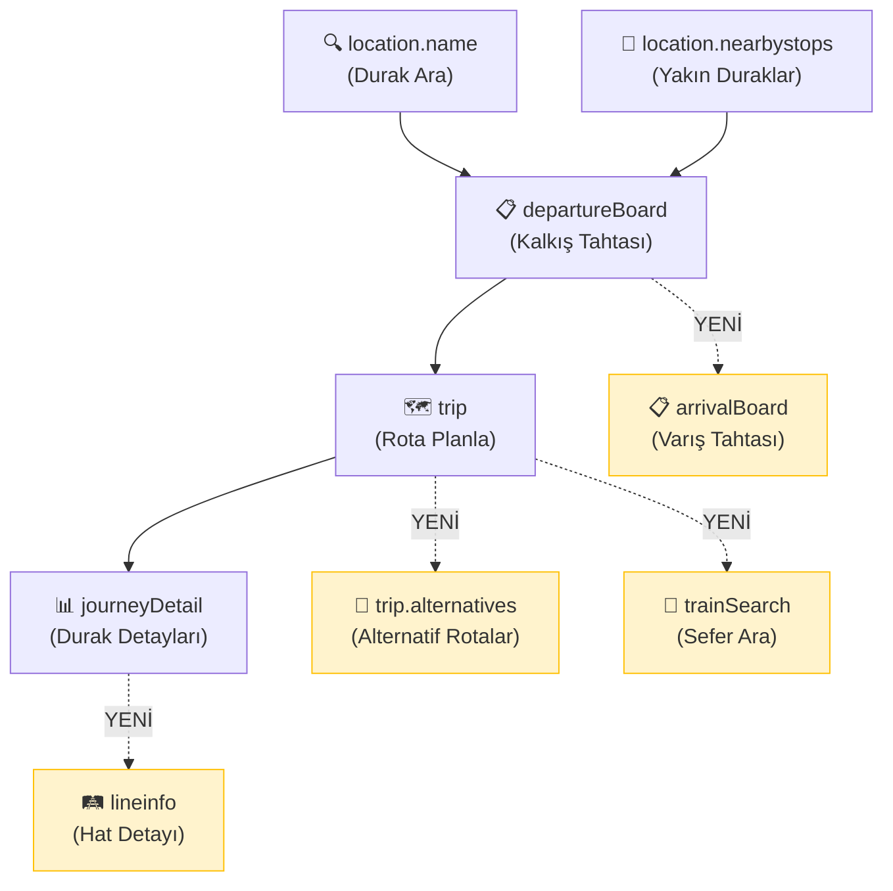

# HAFAS 2.52.0 → TopluTasima: Eklenebilecek Özellikler

Mevcut kodun derinlemesine incelenmesi sonucu, HAFAS API 2.52.0 yetenekleri ile uygulamanın mevcut mimarisi karşılaştırılmıştır. Aşağıda **öncelik sırasına göre** eklenebilecek özellikler detaylandırılmıştır.

> [!NOTE]
> Bu dokümanda hiçbir kod değişikliği önerilmemekte, yalnızca **ne eklenebilir** ve **neden değerli** olduğu anlatılmaktadır.

---

## 🔴 Yüksek Öncelik — Mevcut Akışı Doğrudan İyileştirecek

### 1. `Authorization: Bearer` Header Desteği

| Şu an | Olması gereken |
|--------|---------------|
| `accessId` query parametresi ile gönderiliyor | `Authorization: Bearer <key>` header ile gönderilmeli |

**Neden önemli:**
- API key URL'de açıkça görünüyor (`RmvRetrofitClient.kt` satır 24-69 ve `RmvApiService.kt` satır 314, 514)
- Logcat, proxy tool veya network inspector kullanan biri anahtarı kolayca görebilir
- Header-based auth daha güvenli ve modern
- RMV tarafında query string'deki key'ler loglanıyor olabilir

**Etkilenen dosyalar:**
- [RmvRetrofitClient.kt](file:///c:/Users/mehme/AndroidStudioProjects/TopluTasima/app/src/main/java/com/example/toplutasima/network/rmv/RmvRetrofitClient.kt) — OkHttp Interceptor eklenip tüm isteklere header eklenebilir
- [RmvApiService.kt](file:///c:/Users/mehme/AndroidStudioProjects/TopluTasima/app/src/main/java/com/example/toplutasima/network/RmvApiService.kt) — OkHttp ile yapılan çağrılardaki URL'lerden `accessId` kaldırılır

---

### 2. `requestId` Tracking Desteği

**Şu an:** Hata durumunda sadece HTTP code ve kısa mesaj loglanıyor (örn. satır 318, 517).

**Eklenirse:**
- Her API isteğine `requestId=<UUID>` eklenir
- Hata loglarına bu ID yazılır
- Support'a birebir örnek gönderilebilir
- "Bu request neden hatalı döndü?" sorusuna cevap bulunabilir

**Pratik değer:** Daha önce yaşanan "18:17 yerine 18:23 dönüyor" tarzı sorunlarda, RMV support'a gönderilecek `requestId` ile kesin tespit yapılabilir.

---

### 3. HTTP 429 (API_QUOTA) Yönetimi

**Şu an:** `RmvApiService.kt`'de hata yönetimi genel `Exception` catch'leriyle yapılıyor. Rate limit durumunda kullanıcıya anlamlı bir mesaj gösterilemiyor.

**Eklenirse:**
- HTTP 429 kodu yakalanır
- Kullanıcıya "Kota aşıldı, lütfen biraz bekleyin" mesajı gösterilir
- Opsiyonel: exponential backoff ile otomatik retry
- Opsiyonel: `Retry-After` header'ı okunur

**Etkilenen yerler:** Tüm API çağrılarının `catch` blokları.

---

### 4. `trip.alternatives` Servisi

**Şu an:** `fetchTripBasic()` (satır 510-539) tek bir trip araması yapıp ilk uygun sonucu döndürüyor. `numF=6` ile birkaç sonuç alıyor ama hepsi aynı `trip` endpoint'inden.

**`trip.alternatives` eklenirse:**
- Kullanıcı bir rota seçtikten sonra "Alternatif Rotalar" butonu gösterilebilir
- Aynı bağlamda daha erken/geç/farklı hat kombinasyonları sunulur
- Özellikle aktarmalı yolculuklarda kullanıcıya seçenek sunar

**UI etkisi:** Departure listesi altına veya plan kartına "🔄 Alternatifler" butonu + bottom sheet.

---

### 5. `journeyDetail` Çağrısının Retrofit'e Taşınması

**Şu an:** `fetchJourneyStops()` (satır 306-434) `OkHttp` + `org.json.JSONObject` ile çalışıyor. Ancak `RmvApi` interface'inde zaten bir `getJourneyDetail` tanımı var (satır 53-58).

**Yapılırsa:**
- `journeyDetail` çağrısı Retrofit üzerinden yapılır (zaten tanımlı!)
- `org.json` bağımlılığı adım adım azaltılır
- Tutarlılık artar (diğer servislerin hepsi Retrofit)

> [!IMPORTANT]
> Bu, HAFAS 2.52.0'a özel bir yenilik değil ama API güncellemesiyle birlikte mimarisel tutarlılık için ideal zamanlama.

---

## 🟡 Orta Öncelik — Kullanıcı Deneyimini Zenginleştirecek

### 6. `lineinfo` / `linesearch` Servisleri

**Şu an:** Hat bilgisi sadece trip/departure response'larından parse ediliyor. Hat hakkında ek bilgi (tarife, güzergah haritası, sefer sıklığı) yok.

**Eklenirse:**
- "Hat Detayı" ekranı: Kullanıcı bir hattın üzerine tıklayınca o hattın tam güzergahı, çalışma saatleri ve durakları gösterilir
- SummaryScreen'deki "Top Hatlar" bölümüne tıklanabilirlik kazandırılır
- `linesearch` ile hat ismi araması yapılabilir

**Yeni servis endpoint'leri (RmvApi interface'e eklenecek):**
```
GET lineinfo?accessId=...&id=<lineId>&format=json
GET linesearch?accessId=...&input=<searchTerm>&format=json
```

**UI etkisi:** Yeni bir "Hat Detayları" bottom sheet veya ekran.

---

### 7. `trainSearch` Servisi

**Şu an:** Belirli bir trenin/seferin aranması direkt yapılamıyor. Kullanıcı A→B trip araması yapmak zorunda.

**Eklenirse:**
- "Sefer Ara" özelliği: Kullanıcı doğrudan "S5" veya "RE30" yazarak o seferin güncel durumunu, güzergahını görebilir
- `match` ve `date` parametreleriyle hızlı sonuç
- Sonuç `JourneyDetailList` döner → mevcut `fetchJourneyStops` altyapısı ile doğrudan uyumlu

**Kullanım senaryosu:** "Şu an S5 nerede?" veya "RE30'un bugünkü seferleri."

---

### 8. `arrivalBoard` Servisi

**Şu an:** Uygulama sadece `departureBoard` kullanıyor (satır 169-302).

**Eklenirse:**
- Varış durağı için "Geliş Tahtası" gösterilebilir
- Kullanıcı hem kalkış hem varış durağının canlı verilerini görebilir
- Özellikle "benim trenim ne zaman geliyor?" sorusuna cevap verir

**Retrofit tanımı:**
```
GET arrivalBoard?accessId=...&id=<stopId>&date=...&time=...&format=json
```

---

### 9. `datainfo` Servisi — Metadata Cache

**Şu an:** Product class bitmask'ları ve operator kodları hardcoded regex ile çözümleniyor (`mapTypeTr` fonksiyonları).

**Eklenirse:**
- VehicleType mapping'i API'den dinamik olarak çekilir
- Yeni araç tipleri (ferry, AST vb.) otomatik desteklenir
- Operator bilgisi Firestore kaydına eklenebilir

**Retrofit tanımı:**
```
GET datainfo?accessId=...&format=json
```

---

### 10. `location.name` — `operators` Filtresi (2.51.0)

**Şu an:** `searchStops()` (satır 55-99) tüm operatörlerin duraklarını döndürüyor.

**Eklenirse:**
- Sadece belirli operatörlerin (örn. sadece RMV) duraklarını göster
- Karma veri setlerinde gereksiz sonuçları filtrele
- Parametre: `operators=<operatorCode>`

**Tek satır değişiklik:** `RmvApi.searchStops()` fonksiyonuna `@Query("operators") operators: String? = null` eklenmesi.

---

## 🟢 Düşük Öncelik — Gelecek İçin Stratejik

### 11. `geofeature.nearby` / `geofeature.boundingbox`

**Şu an:** `searchNearbyStops()` sadece durak buluyor (satır 105-165).

**Eklenirse:**
- Harita üzerinde bisiklet istasyonları, park alanları, scooter noktaları gösterilebilir
- `BICYCLE_PATH`, `STATION_AREA`, `PARKING_ZONE`, `GEO_REGION` sorgulanabilir
- Multimodal ulaşım deneyimi (Park & Ride senaryosu)

**Gereksinim:** Harita entegrasyonu (Google Maps / OSM) — mevcut kodda yok.

---

### 12. `reachability` Servisi

**Şu an:** Böyle bir özellik yok.

**Eklenirse:**
- "30 dakikada neresi ulaşılabilir?" analizi
- Isochrone haritası (erişilebilirlik çemberi)
- SummaryScreen'e "Ne kadar alan kapsıyorsun?" istatistiği

**Gereksinim:** Harita entegrasyonu + Canvas/Polygon çizimi.

---

### 13. `rtarchive-v2` — Gecikme Geçmişi

**Şu an:** Gecikme bilgisi sadece kullanıcının manuel girdiği `gercekBinis/gercekInis` üzerinden hesaplanıyor.

**Eklenirse:**
- Geçmiş canlı veri arşivinden hat bazlı gecikme trendi çekilebilir
- SummaryScreen'deki gecikme istatistikleri API verileriyle zenginleştirilebilir
- "Bu hat genelde ne kadar gecikiyor?" sorusuna otomatik cevap

---

### 14. `trafficmessages/datex2` — Trafik Uyarıları

**Şu an:** Disruption/uyarı bilgisi gösterilmiyor.

**Eklenirse:**
- Kalkış tahtasında "⚠️ Bu hatta arıza var" uyarısı
- Plan kartında gecikme/iptal bildirimi
- Push notification potansiyeli

---

### 15. `qrcode.match` — Bilet/QR Eşleme

**Şu an:** Manuel giriş modu var ama QR tarama yok.

**Eklenirse:**
- Kamera ile bilet QR kodu okutulur
- Otomatik olarak ilgili yolculuk eşleşir
- Manuel giriş yerine tek tarama ile kayıt başlatılabilir

**Gereksinim:** CameraX entegrasyonu + ML Kit Barcode Scanner.

---

## 📊 Teknik İyileştirmeler (API'den Bağımsız)

Bunlar HAFAS 2.52.0 ile doğrudan ilişkili olmasa da API güncellemesi sırasında yapılması mantıklı:

| İyileştirme | Mevcut Durum | Kazanım |
|-------------|-------------|---------|
| OkHttp çağrılarını tamamen Retrofit'e taşımak | `fetchJourneyStops`, `fetchTripBasic`, `calculateDistanceORS/Rail` hâlâ OkHttp | Tek auth interceptor, tutarlı hata yönetimi |
| `org.json` → `kotlinx.serialization` geçişi | İkili parsing mevcut | Tek serialization kütüphanesi |
| `format=json` default yapmak yerine `Accept: application/json` header kullanmak | Query param ile | Daha temiz URL'ler |
| Checksum alanlarını (`checksumDti`, `checksumSave`) saklamak | Trip parse'da yok | Veri bütünlüğü kontrolü |

---

## 🗺️ Uygulama Akış Önerisi

Mevcut kullanıcı akışı ve HAFAS servisleri eşleştirmesi:



**Sarı kutular** yeni eklenebilecek servisleri gösterir. Mevcut akış (beyaz kutular) bozulmadan genişletilir.

---

## ⚡ Hızlı Kazanımlar (Quick Wins)

En az değişiklikle en çok değer katacak 5 özellik:

1. **Bearer Auth** — OkHttp interceptor + `@Query` kaldırma → güvenlik ↑
2. **requestId** — Her çağrıya `requestId=UUID` ekle → debug ↑  
3. **HTTP 429 handling** — Catch bloklarına 429 kontrolü → kullanıcı deneyimi ↑
4. **operators filtresi** — `@Query` param ekle → arama kalitesi ↑
5. **Retrofit'e tam geçiş** — `fetchJourneyStops` ve `fetchTripBasic` → tutarlılık ↑

> [!TIP]
> Bu 5 özellik, mevcut dosya yapısında minimal değişiklikle uygulanabilir ve yeni ekran/UI gerekmez.
